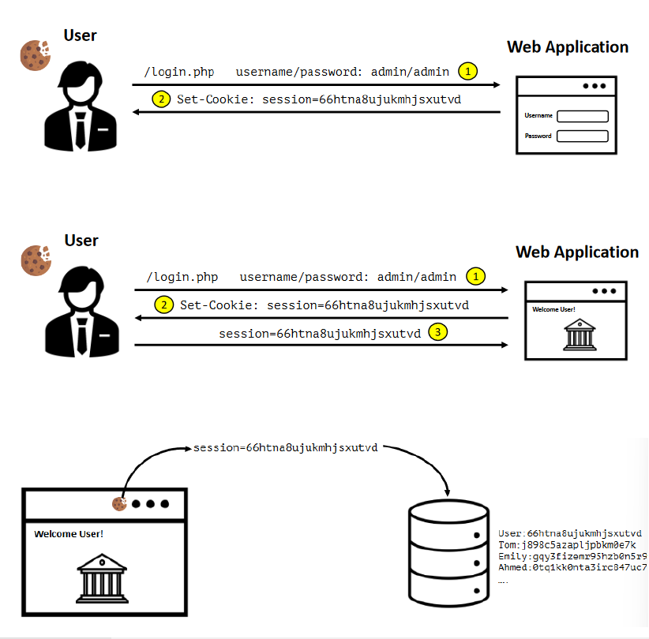

# CSRF Labs.
More information look in Cheatsheet.
 

 
1- Web Security Academy --> [CSRF](https://portswigger.net/web-security/csrf).
 

2- Web Application Hacker’s Handbook --> Chapter 13 - Attacking Users: Other Techniques (pgs. 504– 511).
 

3- OWASP --> [CSRF](https://owasp.org/www-community/attacks/csrf).
 

4- Cross-Site Request Forgery Prevention Cheat Sheet --> [CSRF](https://cheatsheetseries.owasp.org/cheatsheets/Cross-Site_Request_Forgery_Prevention_Cheat_Sheet.html).
 

5- Reviewing Code for Cross-Site Request Forgery Issues Overview --> [CSRF](https://owasp.org/www-project-code-review-guide/reviewing-code-for-csrf-issues).