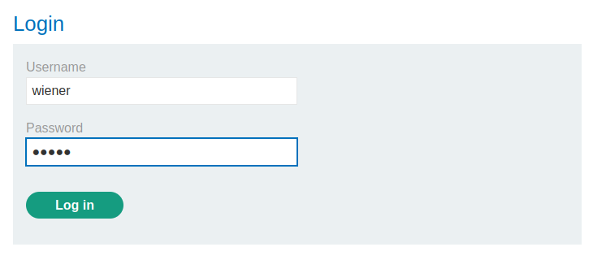
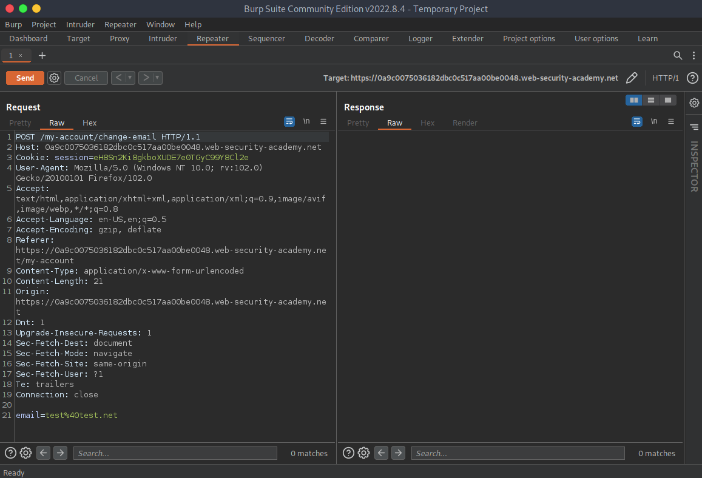
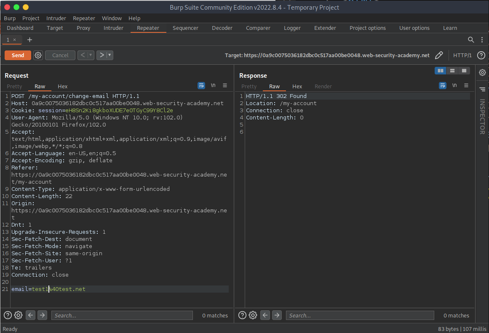
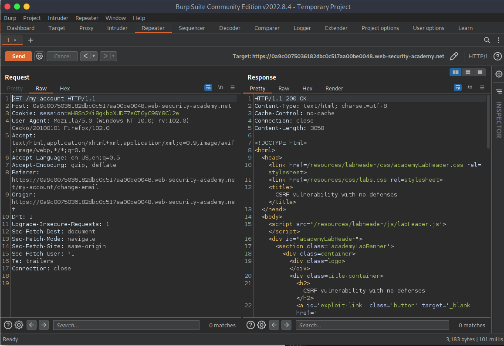
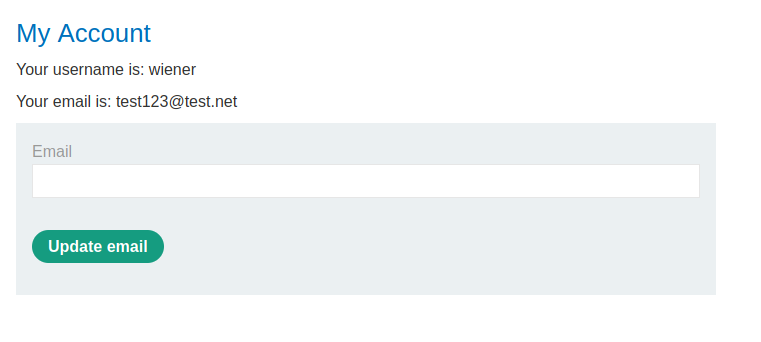
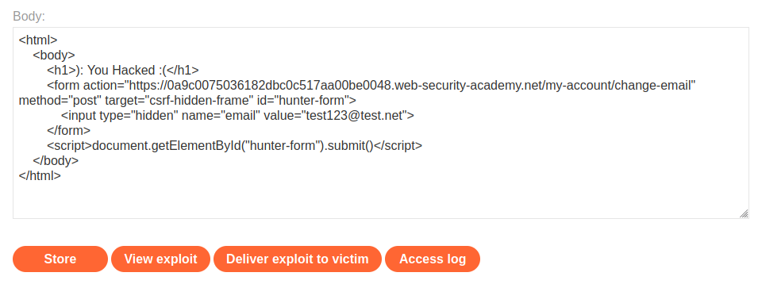

# CSRF-Lab-01
This is .
 

# Solve Lab-01
1- login as wiener/peter.
 

 
2- intersection the request in `Proxy` tab and send to `Repeter`.
 

 
3- Change the email the send request then appear 302 status code redirection message.
 

 
4- After redirection.
 

 
5- Then go to terminal in the location file `python3 -m http.server 9000`, go to the browser `127.0.0.1:9000/file_name`, go to the lab tab, wil find email changed.
 

 
6- Final To solve this lab go to `Go to exploit server` in lab tab, then past the `html` in the `body` section, then press `Dilever exploit to victim`.
 

