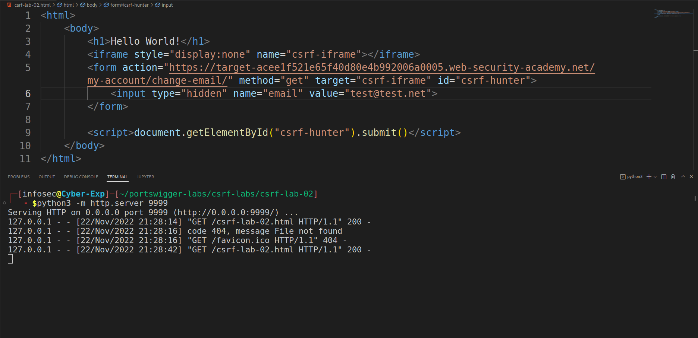

# CSRF-Lab-02
This is [Link-Lab](https://portswigger.net/web-security/csrf/lab-token-validation-depends-on-request-method).
 

# Solve Lab-02
1- login as wiener/peter.
 

 

2- intersection the request in `proxy` tab and send to `Repeater`.
 

3- try delete the `csrf` token then send request, but 400 status code is a not found page.
 

 

4- change the method `post` to `get` request then send request, will appear 302 status code is a redirection message.
 

 

5- After redirection.
 

 

6- try delete `csrf` token in `get` method, will appear redirection code status 302 redirection.
 

 

7- To exploit this vulnerability to use the script, and run `python3 -m http.server 9999` in terminal.
 

 

8- Go to browser and write in tab `127.0.0.1:9999/csrf-lab-02.html`.
 

 

9- Go to tab lab, will find email changed.
 

 

10- OR go to `Go to exploit server`, then past the `html` in the body section.
 

11- finally, congratulations your lab is solved successfully.
 

