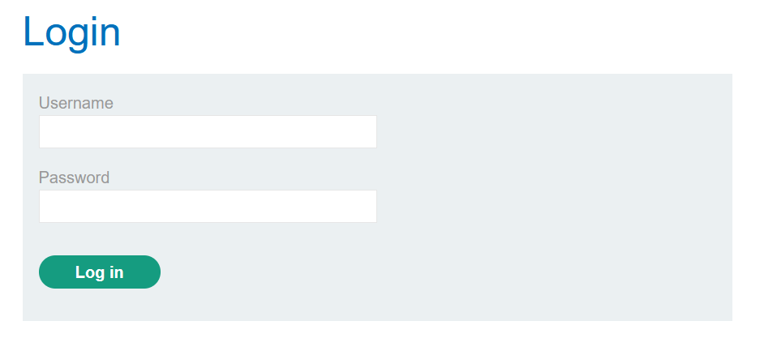

# CSRF-Lab-03
This is [Link-Lab](https://portswigger.net/web-security/csrf/lab-token-validation-depends-on-token-being-present).
 

# Solve Lab-03
1- Login as wiener/peter.
 

 

2- Intersection the request in `proxy` tab and send to `Repeater`, then try delete the csrf token --> will appear 302 status code redirection code.
 

 

3- After redirection.
 

 

4- try to change `csrf` token, will appear message `Invaild csrf token`.
 

 

5- To exploit this vulnerability to use the script, and run `python.exe -m http.server 5555` in terminal.
 

 

6- OR go to `Go to exploit server`, then copy and past the html in the body section, finally solved the lab.
 

 