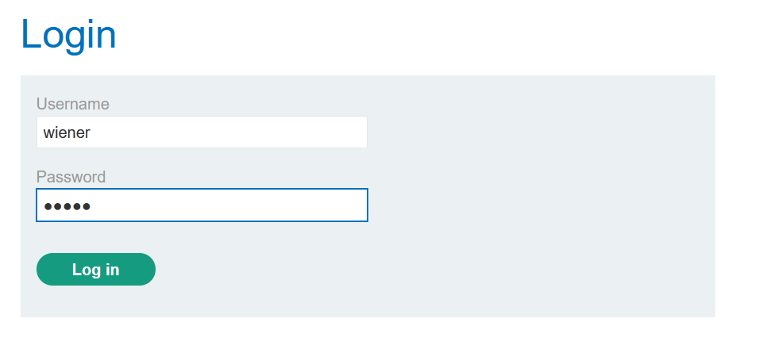
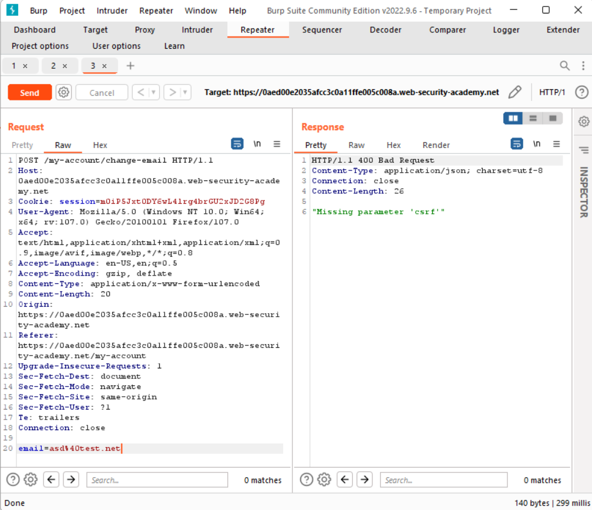
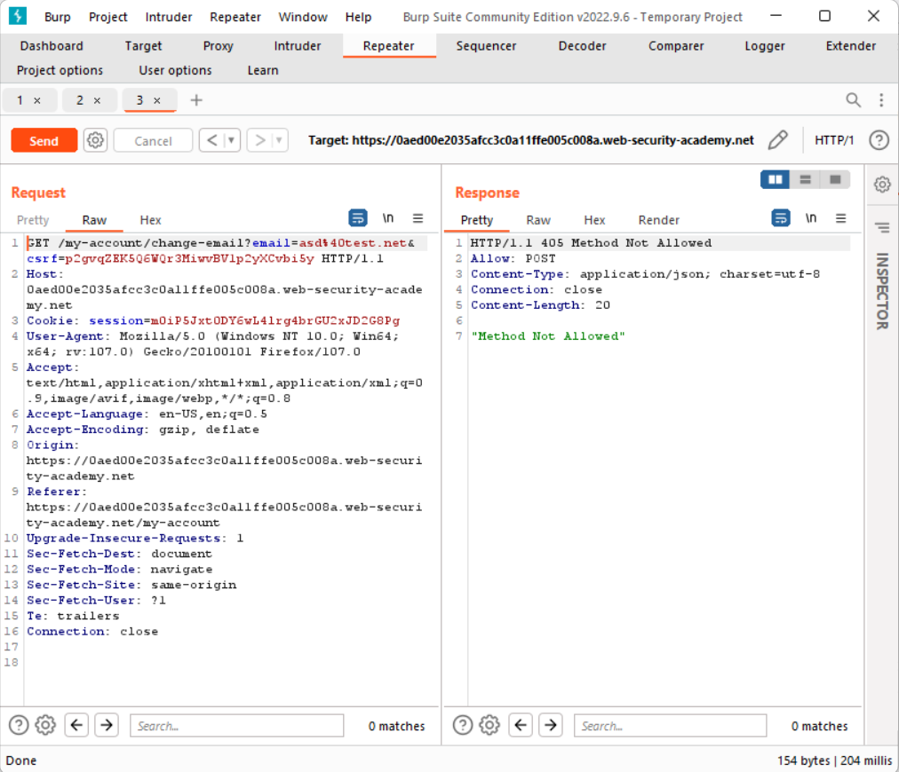
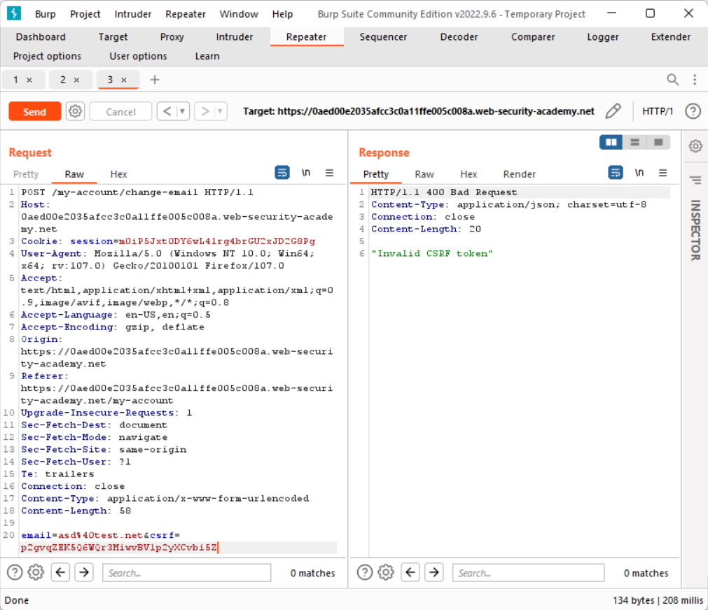
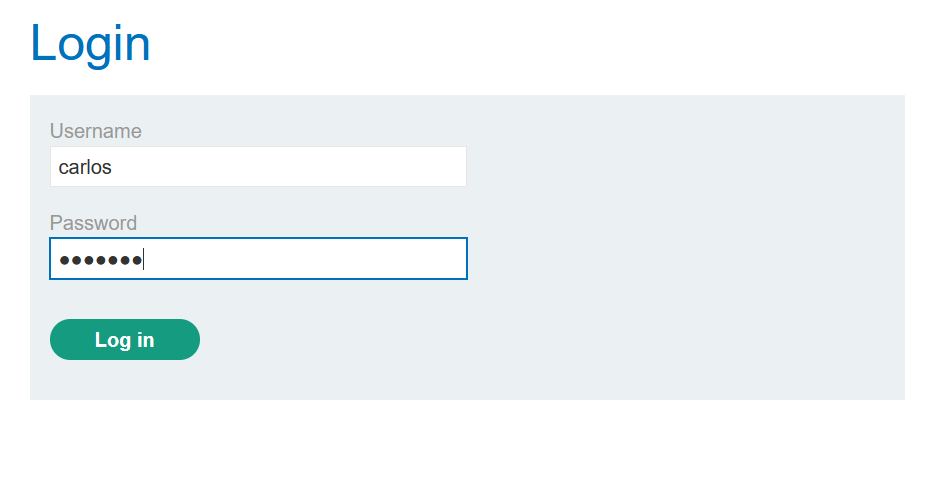
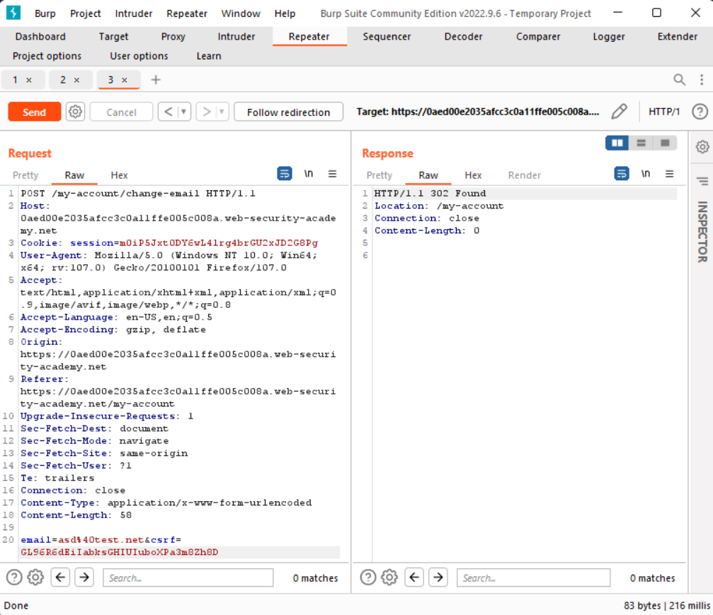
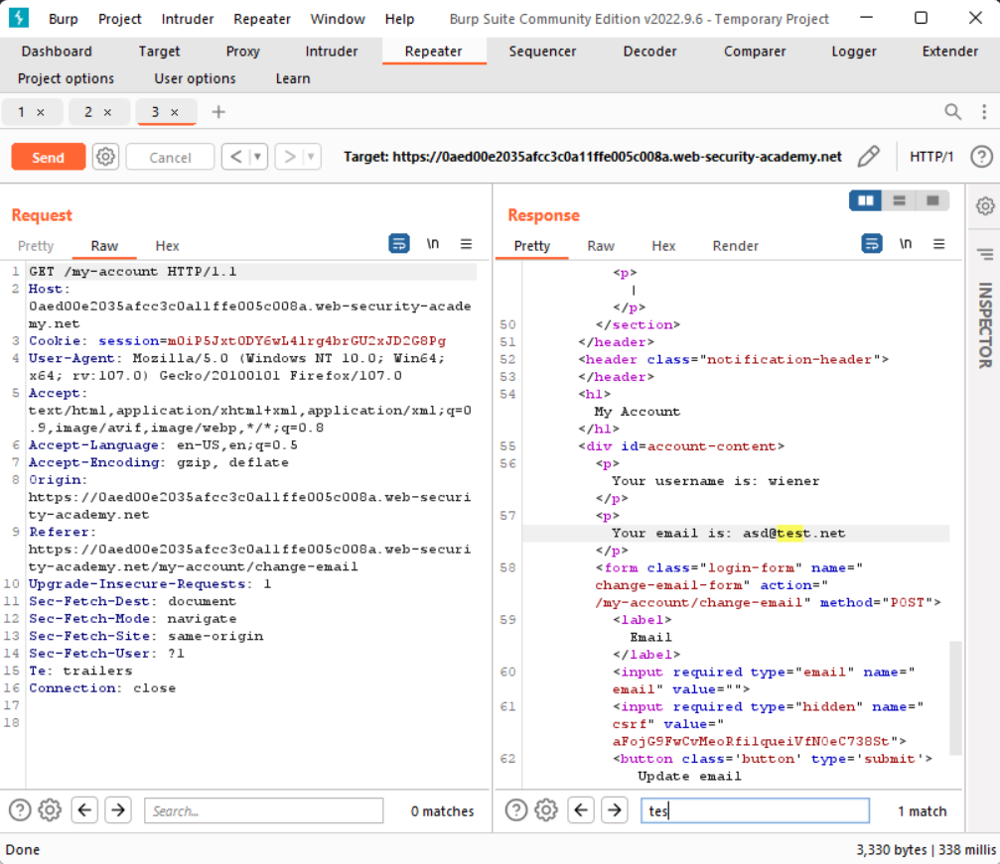
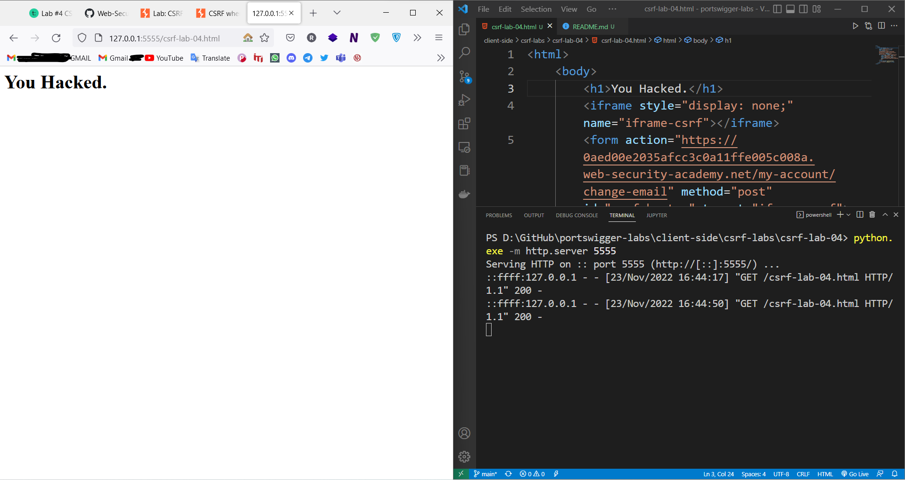
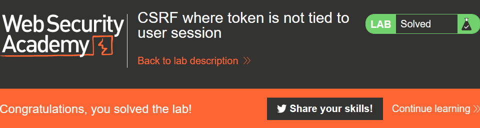

# CSRF-Lab-04
This is [Link-Lab](https://portswigger.net/web-security/csrf/lab-token-not-tied-to-user-session).
 

# Solve Lab-04
1- login as wiener/peter.
 

 

2- Try remove `csrf token` and send request, then show message `Missing Parameter 'csrf' `.
 

 

3- Convert request method from `post` to `get`, then show `Method Not Allowed.`.
 

 

4- Try that modify on the `csrf token`, then show `Invalid CSRF Token`.
 

 

5- After doing the last steps, try login as `carlos/montoy`.
 

 

6- Inspect in input email --> copy and past `csrf` for `carlos` and past override `csrf` for `peter`, the show `302 code status` redirection.
 

 

7- After redirection.
 

 

8- To exploit this vulnerability to use the script, and run `python3 -m http.server 5555` in terminal. 
 

 

9- OR go to `Go to exploit server`, then past the `html` in the body section, then show `solved` lab.
 

 