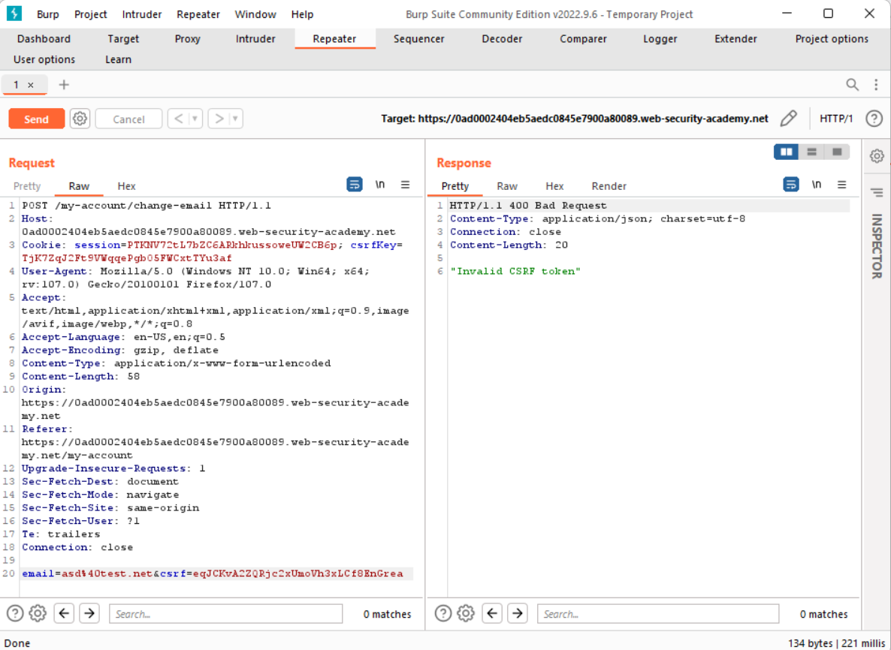
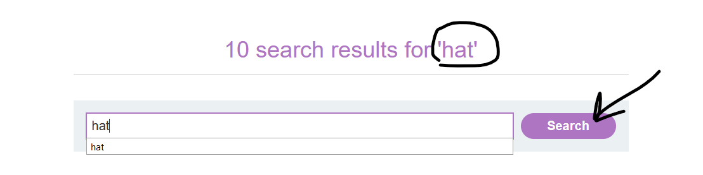
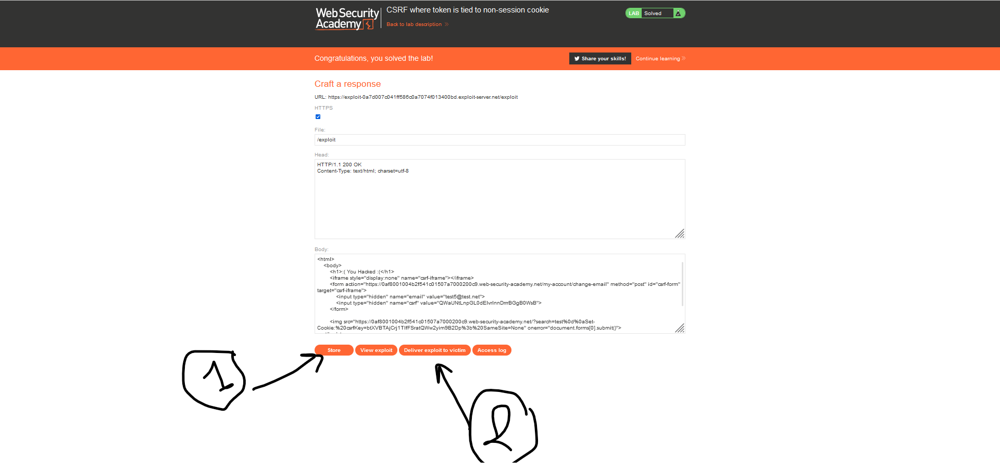

# CSRF-Lab-05.
This is [Link-Lab](https://portswigger.net/web-security/csrf/lab-token-tied-to-non-session-cookie).
 

# Solve Lab-05.
1- login as wiener/peter.
 

 

2- After Intersection the request, try modify the `csrf`, ex: remove character then replaced another character, but you will fing message `Invalid csrf token`.
 

 

3- After login as carlos/montoya, got to `My account`, show `inspect`, copy and past `csrf`, but you will message `Invalid csrf token`.
 

 

4- try again copy and past `csrfKey` from attacker `carlos`, then show `302 status code redirection`.
 

 

5- After redirection.
 

 

6- Go to home and try search from `hat` for examle, notes show new parameter --> `LastSearchTerm=hat`.
 

 

 

7- set new parameter with request `Set-Cookie:%20csrfKey=btXVBTAjCrj1TIfFSratQWw2yim9B2Dp%3b%20SameSite=None`, until you send `csrf` with request.
 

 

8- To exploit this vulnerability, `Go To Exploit Victim` and copy past the `script` attached.
 

 