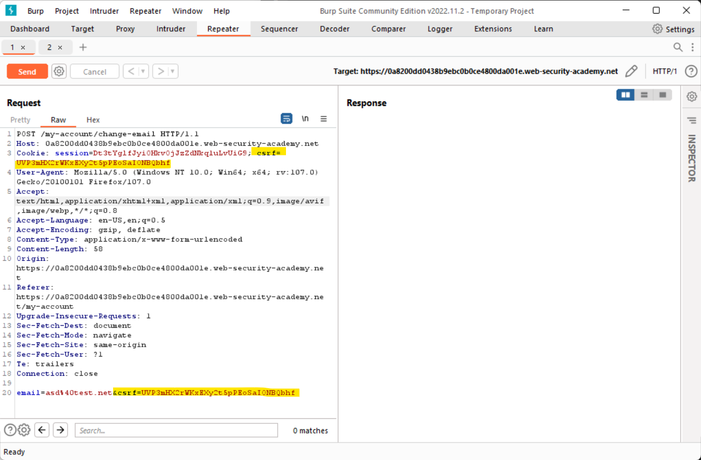
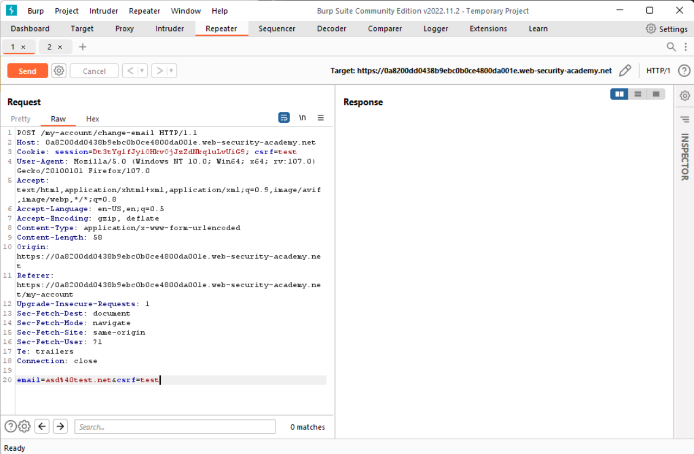
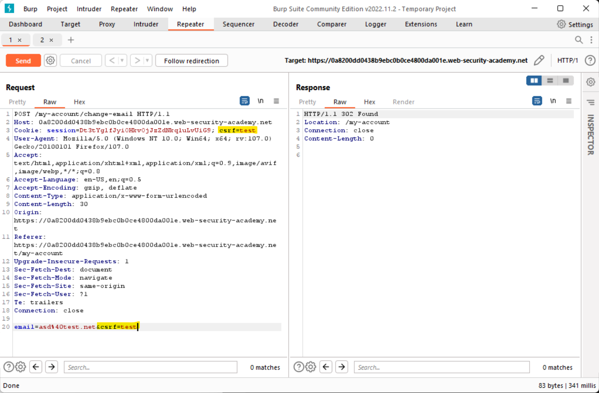
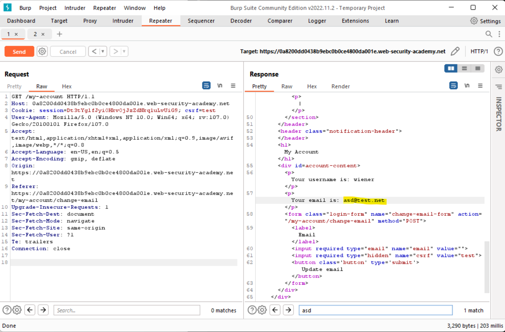
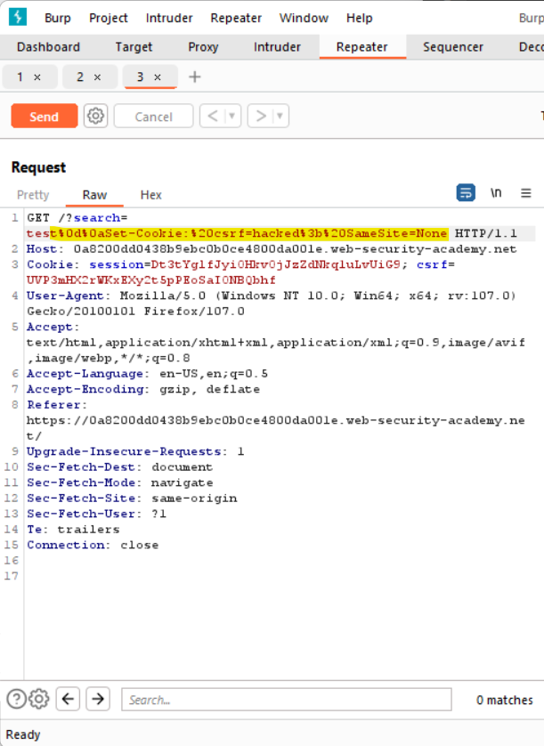
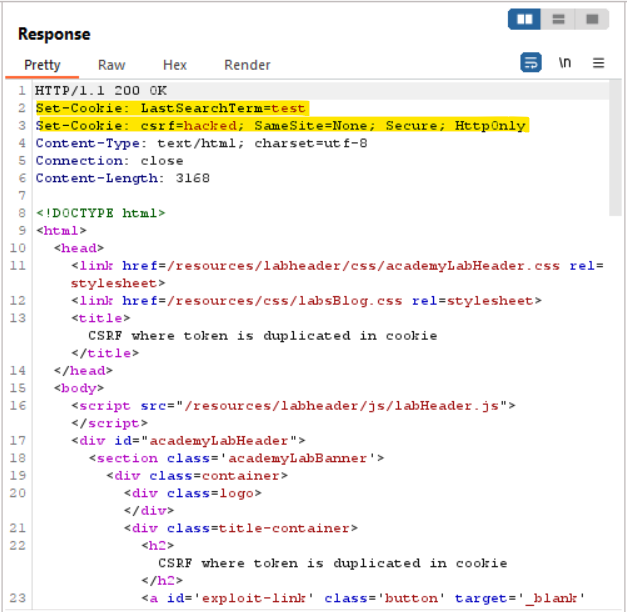
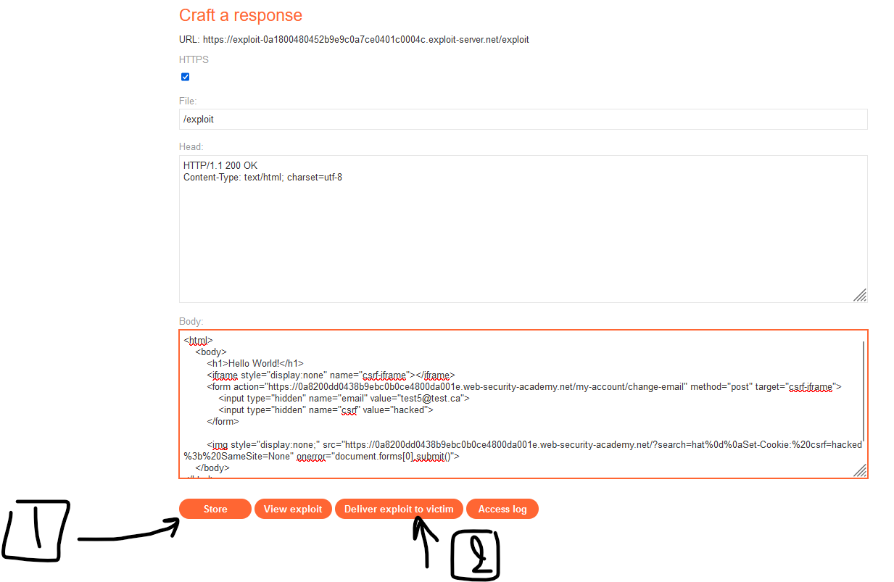
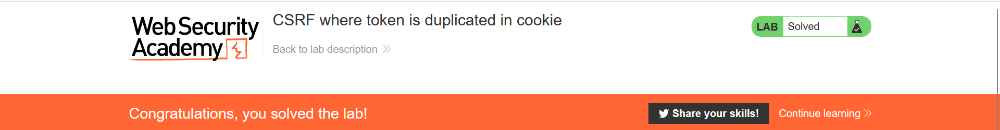

# CSRF-Lab-06.
This is [Link-Lab](https://portswigger.net/web-security/csrf/lab-token-duplicated-in-cookie).
 

# Solve Lab-06.
1- login as wiener/peter, and intersection the request and check it, you will find `csrf token and session` are same.
 

 

2- Try change value of `csrf session and token` with another value, for example: `test`.
 

 

3- After send the request, you will find the message `302 code status redirection`.
 

 

4- After redirection.
 

 

5- Try search `hacked`, you will find new parameter `LastSearchTerm=hacked`, but we need to that add `csrf cookie while send request of search`.
 

 

6- After send the request, look at the response.
 

 

7- To exploit this lab and solve it, use the `scipt` html, and `Go To Exploit Victim`, then `store`, and `send to victim`.
 

 

 