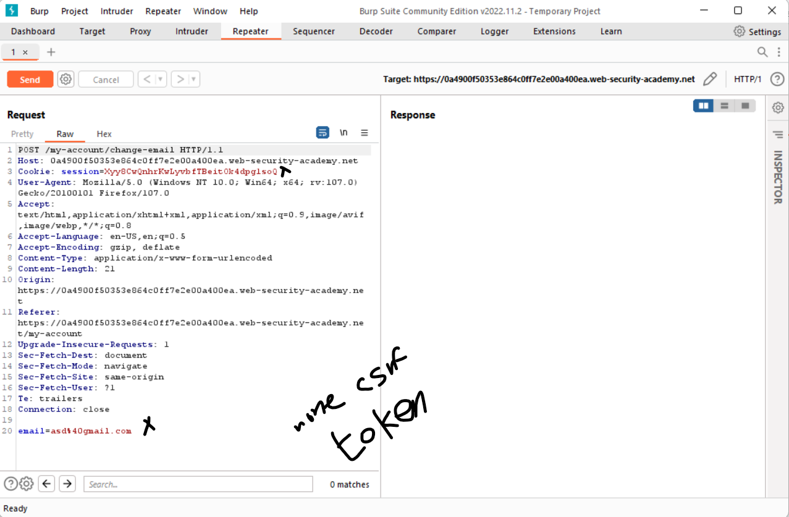
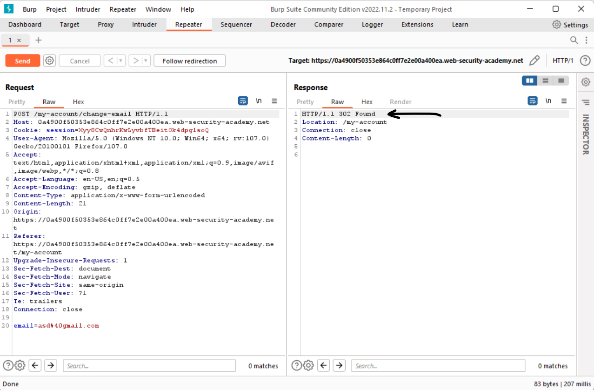
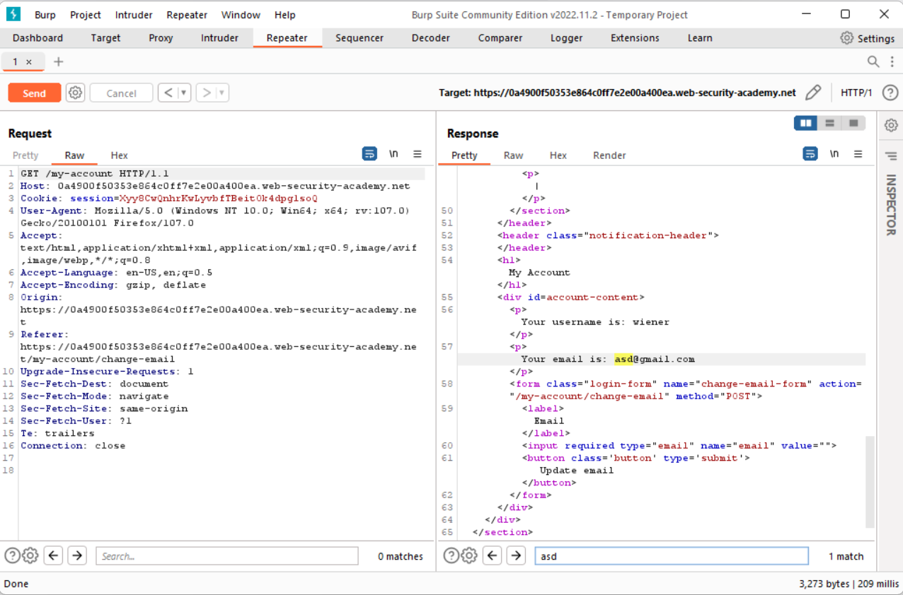
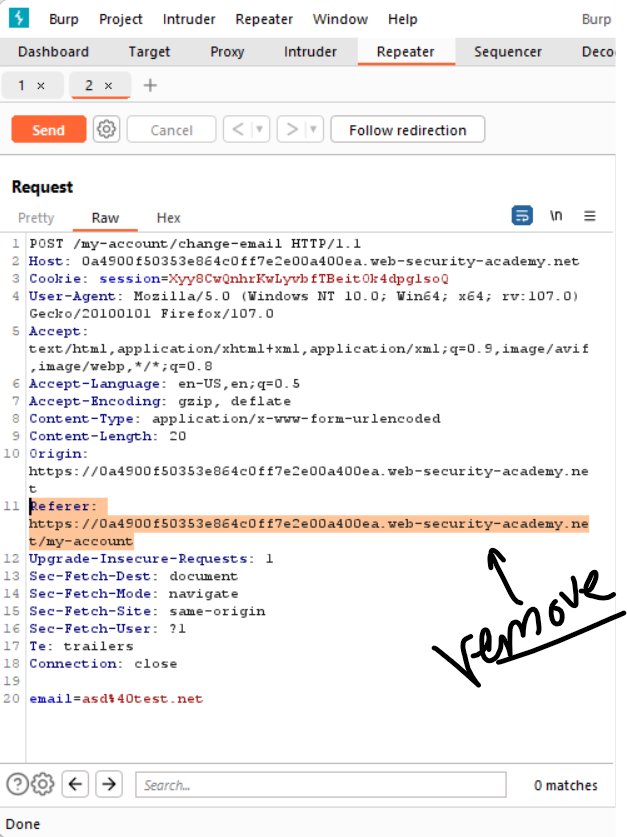
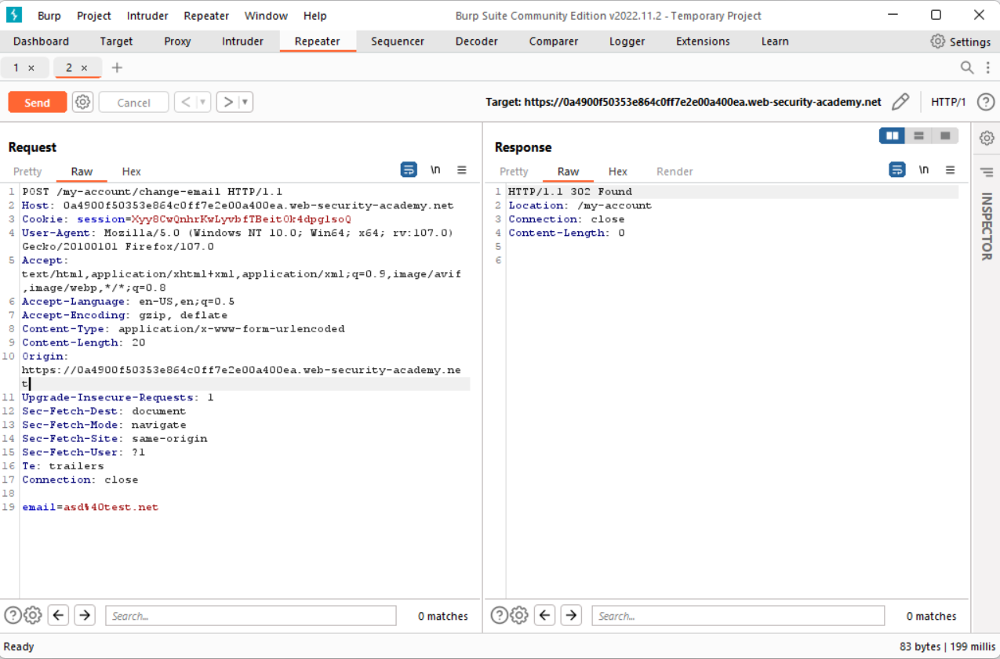
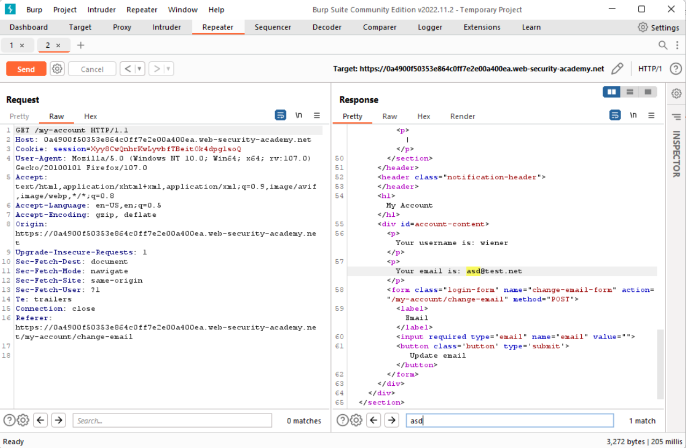
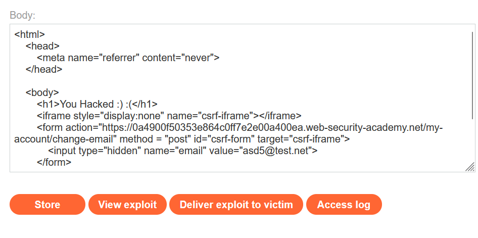
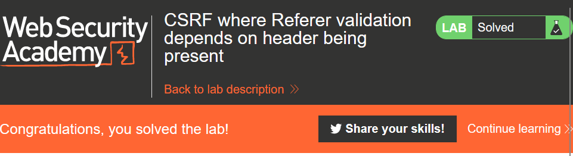

# CSRF-Lab-07.
This is [Link-Lab](https://portswigger.net/web-security/csrf/lab-referer-validation-depends-on-header-being-present).
# Solve Lab-07.
1- login as `wiener/peter`, and intersection the request and check it, you will not find `csrf token and session`.
 

 

2- Try send the request, you will appear `302 status code redirection`.
 

 

3- After redirection.
 

 

4- Testing Referer header for CSRF attacks --> `Remove the Referer header`.
 

 

5- Try send the request after remove the `reserer header`, you will appear `302 status code redirection`.
 

 

6- After redirection.
 

 

7- To exploit this lab, using `html script` copy and past in `body --> Go To victim server`.
 

 

8- Finally solved the lab.
 

 