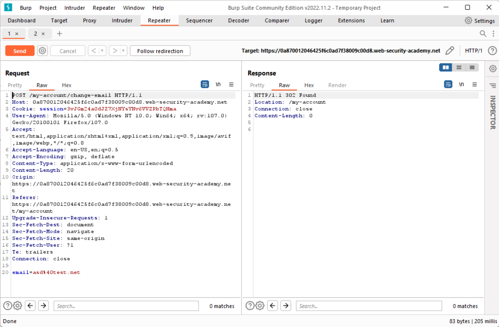
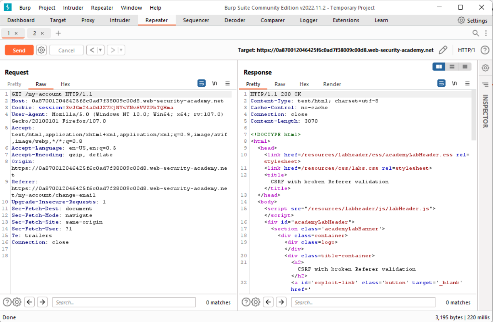
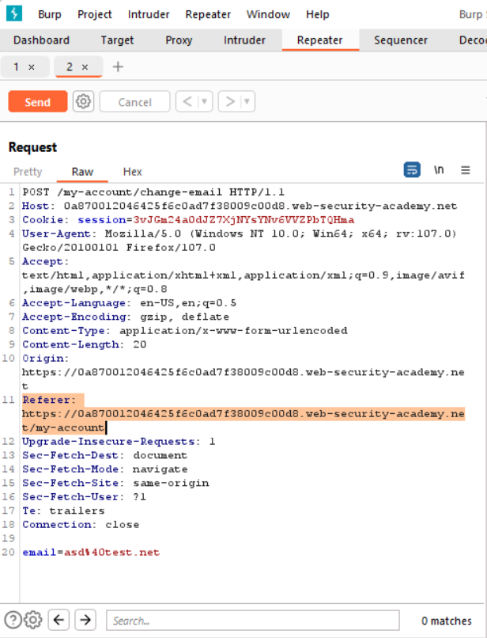
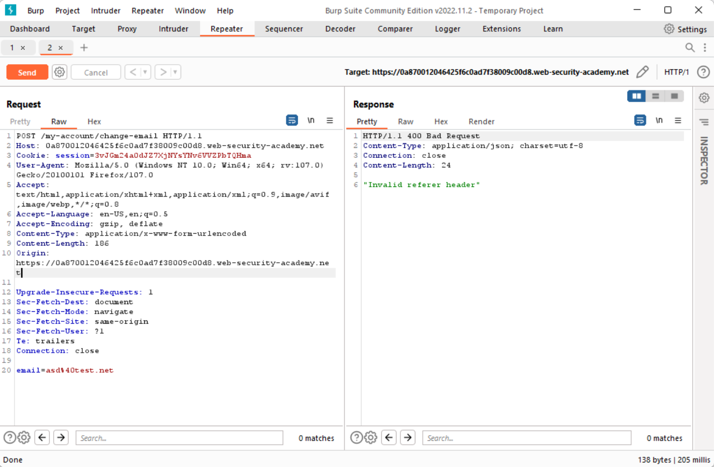
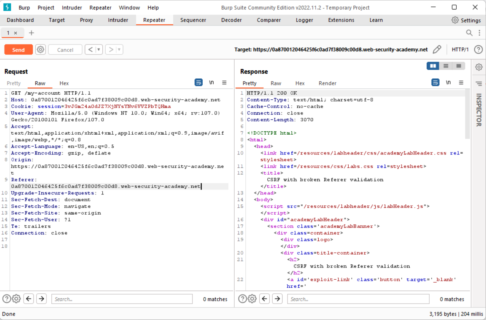
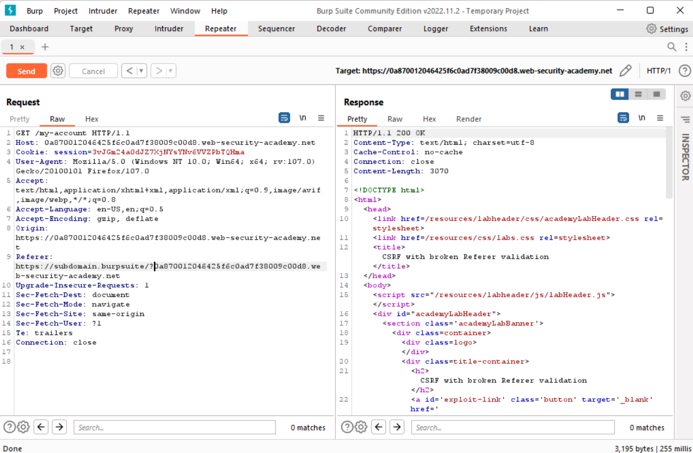
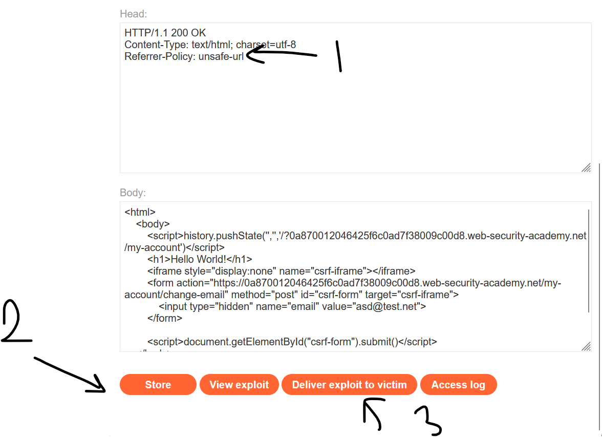
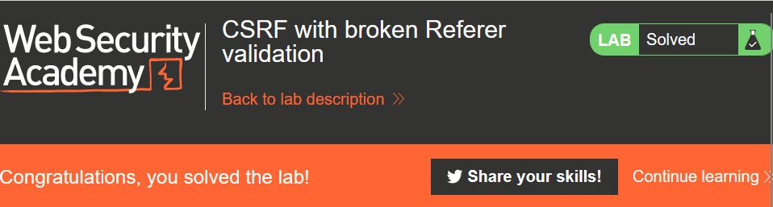

# CSRF-Lab-08.
This is [Link-Lab](https://portswigger.net/web-security/csrf/lab-referer-validation-broken).
# Solve Lab-08.
1- 1- login as `wiener/peter`, and intersection the request and check it, you will not find `csrf token and session`, and try send the request, you will appear `302 status code redirection`. 
 

 

2- After redirection.
 

 

3- Testing Referer header for CSRF attacks --> remove the Referer header.
 

 

4- Your will appear message `Invalid referer header`.
 

 

5- Try remove value of referer header and change with another value.
 

 

6- Try again, `Check which portion of the referrer header is the application validating`.
 

 

7- To exploit this lab, using `html script` copy and past in body --> `Go To victim server`.
 

 

8- Finally solved the lab.
 

 